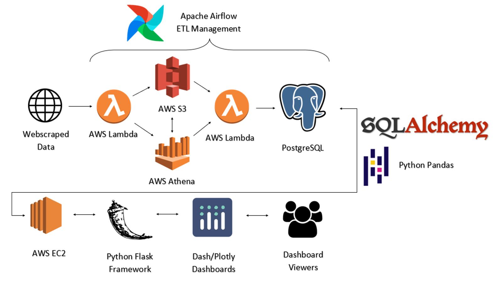
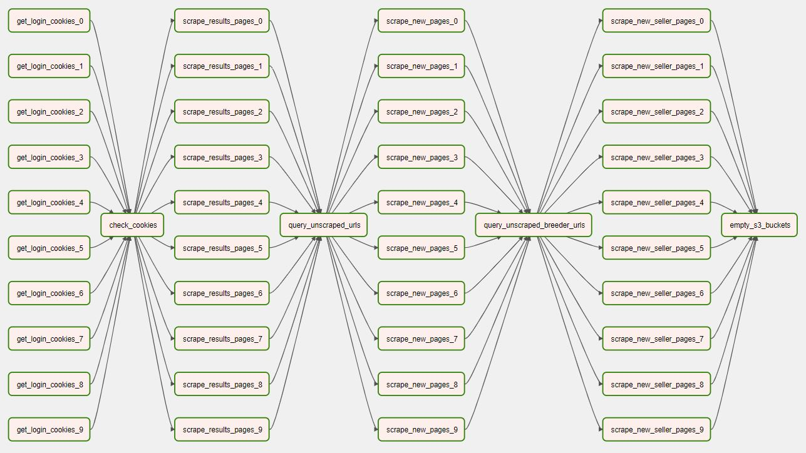
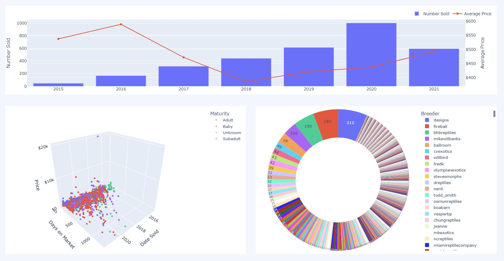

  

# A Data Visualization and Analytics Platform for the Reptile Industry

Most billion dollar industries have many large corporations who employ full-time business analysts to crunch numbers and analyze data, making prices and margins competitive.

The exotic reptile trade is a rare exception, with only a handful of medium sized players and with the majority of the industry being comprised of “Mom and Pop” operations there are potentially undiscovered high margin opportunities. These animals frequently sell for four and even five figures but live inside an enclosure the size of a shoe box.

Reptoro is the first and only data visualization and analytics platform specific to the Exotic Reptile Industry.

## How it Works

Reptoro continuously webscrapes industry marketplaces, adding new animals and breeders to the database as well as tracking price and status changes to existing listings.

Below is a flowchart of the cloud-based tech stack and ETL pipeline. [Apache Airflow](https://github.com/apache/airflow) is used to schedule and orchestrate periodic webscrapes using AWS Lambda Functions to request and parse data.

Data is dumped into an AWS S3 bucket where it is cleaned and transformed using AWS. After the scrape is over a Lambda Function updates our PostgreSQL database.

[Reptoro.com](https://www.reptoro.com) is hosted on an AWS EC2 instance, runs on a Flask framework and utilizes [`dash`](https://github.com/plotly/dash) to interactively display data on dashboards.

## ETL Pipeline

Below you'll see a flowchart of our ETL Pipeline from the Apache Airflow GUI. All long tasks in the pipeline are conducted at 10x concurrency using Boto3 to trigger multiple Lambda Functions at the same time.

In the first step a Chrome Browser is rendered in the Lambda Function using Selenium to interact with the website, login to an account and extract the Session ID so that it can be passed in to other Lambda Functions to access login-required data.

After the login Session IDs are extracted, they are passed down the pipeline and more Lambda Functions scrape all search results pages. The URLs are queried against the PostgreSQL database to check for listings that are not already in the database.

The new listings are then scraped and inserted into the database, the same process is completed for all sellers profiles.

## Web App

Reptoro is hosted on an AWS EC2 instance using AWS ElasticBeanstalk to auto-scale and provision resources, so that the website will still function during an influx of requests.

The Web Application is written in Python using [`flask`](https://github.com/pallets/flask) and [`Jinja2`](https://github.com/pallets/jinja) in tandem with a Bootstrap template to quickly build a beautiful dynamic user interface.

Pandas DataFrames created using the [`sqlalchemy`](https://github.com/sqlalchemy/sqlalchemy) ORM to query the database and pass the DataFrame into the Dash framework and quickly yield interactive 2D and 3D visualizations.

